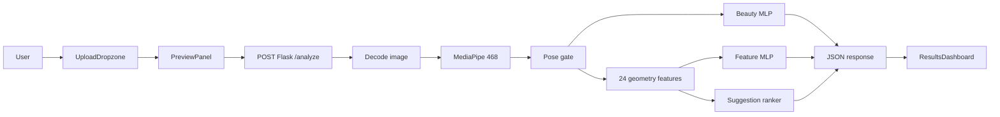
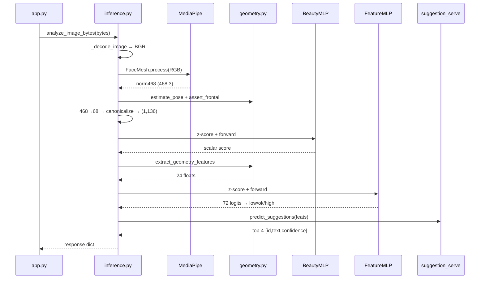
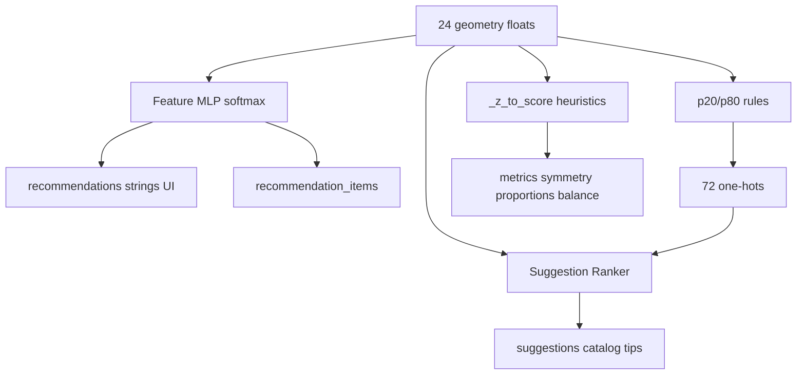

# Glow-Mark — Knowledge Transfer Guide

**Audience:** Engineers joining the project or running a KT session  
**Scope:** How an image uploaded on `/analyze` becomes a beauty score, geometry diagnostics, and recommendations  
**Canonical live path:** Next.js `/analyze` → Flask `POST /analyze` → MediaPipe + three MLPs

---

## Table of contents

1. [System overview](#1-system-overview)
2. [Frontend `/analyze` path](#2-frontend-analyze-path)
3. [Backend API entry](#3-backend-api-entry)
4. [Core orchestrator: `inference.py`](#4-core-orchestrator-inferencepy)
5. [MediaPipe — purpose and mechanics](#5-mediapipe--purpose-and-mechanics)
6. [Geometry feature contract (24 features)](#6-geometry-feature-contract-24-features)
7. [The three MLPs](#7-the-three-mlps)
8. [Recommendation layers (mental model)](#8-recommendation-layers-mental-model)
9. [Offline data and training pipeline](#9-offline-data-and-training-pipeline)
10. [Repo map and live demo talk track](#10-repo-map-and-live-demo-talk-track)
11. [KT gotchas](#11-kt-gotchas)

---

## 1. System overview

Glow-Mark is a facial analysis product. A user uploads a selfie (or portrait), the system detects a single frontal face, extracts landmarks, runs three neural models, and returns:

| Product | Source | What the user sees |
|---------|--------|--------------------|
| **Beauty score** (0–100) | Beauty MLP | Big score on results |
| **UI metrics** | Heuristic from geometry z-scores | Symmetry / proportions / balance |
| **Geometry ratios** | 24 locked feature floats | Ratios tab |
| **Recommendations** | Feature MLP (non-`ok` classes) | Recommendations tab (string list) |
| **Catalog suggestions** | Suggestion ranker | Returned in JSON; **not wired into UI today** |
| **Landmarks / 3D** | MediaPipe 468 | Overlay + Face Mesh 3D tab |

### Architecture

```text
┌─────────────────────┐         multipart image          ┌──────────────────────┐
│  Next.js (port 3000)│ ────────────────────────────────► │ Flask (port 5001)    │
│  /analyze page      │ ◄──────────────────────────────── │ POST /analyze        │
│  Firebase auth      │         JSON result               │ inference.py         │
└─────────────────────┘                                   └──────────┬───────────┘
                                                                     │
                          ┌──────────────────────────────────────────┼──────────────────────────┐
                          ▼                                          ▼                          ▼
                   MediaPipe FaceMesh                         Beauty MLP                  Feature MLP
                   468 landmarks                              136 → 1 score               24 → 72 logits
                          │                                                                     │
                          └──────────────────► Geometry 24 floats ◄─────────────────────────────┘
                                                      │
                                                      ▼
                                            Suggestion Ranker (96 → K)
                                            top-4 catalog tips
```

### End-to-end flow (mermaid)



**Mental model for KT:** one landmark front-end (MediaPipe + frontal gate) feeds **three products** — score, geometry diagnostics, and catalog tips. Products 2 and 3 share the same 24 geometry floats but **do not share class decisions** at serve time (Feature MLP softmax vs percentile thresholds).

---

## 2. Frontend `/analyze` path

### Key files

| Role | Path |
|------|------|
| Page route | `app/analyze/page.tsx` |
| Auth gate | `components/protected-route.tsx` |
| Upload UI | `components/upload-dropzone.tsx` |
| Preview / CTA | `components/preview-panel.tsx` |
| Progress UI | `components/processing-stepper.tsx` |
| Results | `components/results-dashboard.tsx` |
| State | `store/analysis-store.ts` |
| Validation | `lib/schemas.ts`, `lib/constants.ts` |

### UI state machine

1. **Idle / upload** — `UploadDropzone` (drag-drop or file picker)
2. **Preview** — object URL preview + “Start Analysis”
3. **Processing** — `ProcessingStepper` (cosmetic delays; **no client ML**)
4. **Success** — `ResultsDashboard`
5. **Error** — `ErrorState` + toast

Requires Firebase auth via `ProtectedRoute`.

### Upload validation (client)

- Types: `image/jpeg`, `image/png`, `image/webp`
- Max size: **5MB** (`MAX_FILE_SIZE`)
- No resize, crop, or EXIF stripping — the raw `File` is sent as-is

### API call

```ts
const form = new FormData()
form.append('image', selectedFile)
const backendUrl = process.env.NEXT_PUBLIC_BACKEND_URL || 'http://localhost:5001'
const resp = await fetch(`${backendUrl}/analyze`, { method: 'POST', body: form })
```

Env: `NEXT_PUBLIC_BACKEND_URL` (example `http://127.0.0.1:5001`).

### How the response is mapped

The page maps Flask JSON into `AnalysisResult`:

- Uses: `score`, `metrics`, `landmarks`, `ratios`, `recommendations`, `recommendation_items`
- Replaces backend `notes` with hardcoded privacy/UX notes
- **Drops** `suggestions` and `score_raw` from what the UI consumes

### What the Recommendations tab shows

`ResultsDashboard` renders `result.recommendations` only — a list of strings like `"nose_width_ratio: high"`.

It does **not** currently render:

- `recommendation_items` (structured `{label, class, confidence}`) — stored but unused in UI
- `suggestions` (catalog tips from the ranker) — returned by backend, never mapped into the page result

### After success

If the user is logged in, `saveAnalysisResult` writes metrics/recs to Firestore (**no image**). Landmarks are typically summarized (count), not fully persisted.

### Non-canonical paths (do not confuse in KT)

| Path | What it does | Relation to `/analyze` |
|------|----------------|------------------------|
| `app/api/analyze/route.ts` | Returns **501** | Dead / stub — **not** used by the page |
| `app/dashboard/page.tsx` | Client MediaPipe + `lib/analysis/beauty-scorer.ts` | Separate pipeline; different recommendations |
| `lib/mediapipe/face-landmarker.ts` | Browser Face Landmarker | Used by dashboard, not by `/analyze` |

---

## 3. Backend API entry

**File:** `backend/app.py`  
**Server:** Flask + CORS  
**Default port:** `5001` (avoids clash with Next.js on 3000)

| Method | Path | Behavior |
|--------|------|----------|
| `GET` | `/health` | `{"ok": true}` |
| `POST` | `/analyze` | Multipart field `image` → `analyze_image_bytes()` |

### Request validation

1. Field `image` must exist
2. MIME must be `image/jpeg` \| `image/png` \| `image/webp`
3. Size ≤ 5MB
4. Then decode + full ML pipeline

### Error responses

```json
{ "error": "<CODE>", "details": "optional string" }
```

| Code | Typical cause |
|------|----------------|
| `INVALID_FILE_TYPE` | Missing file or wrong MIME |
| `FILE_TOO_LARGE` | > 5MB |
| `CORRUPT_FILE` | `cv2.imdecode` failed |
| `NO_FACE_DETECTED` | MediaPipe found 0 faces |
| `MULTIPLE_FACES_DETECTED` | MediaPipe found > 1 face |
| `FACE_TOO_ANGLED_OR_SMALL` | Pose gate or degenerate geometry |
| `UNKNOWN_ERROR` | Unexpected exception (HTTP 500) |

Frontend maps these via `ERROR_CODES` / `ERROR_MESSAGES` in `lib/constants.ts`.

---

## 4. Core orchestrator: `inference.py`

**File:** `backend/inference.py`  
This is the heart of serve-time ML. Everything else is loaders, geometry math, or suggestion serving.

### Sequence diagram



### Function-by-function

| Symbol | Role | Inputs | Outputs |
|--------|------|--------|---------|
| `AnalyzeError` | Typed error for Flask | `code`, `http_status`, `details?` | Raised → JSON error |
| `MP_468_TO_68` | Index map | — | 68 MediaPipe indices ≈ classic 68-landmark layout |
| `_mlp_beauty(in_dim)` | Build beauty Sequential | typically 136 | `Linear→ReLU→Dropout→…→1` |
| `_mlp_feature(in_dim, out_dim)` | Build feature Sequential | 24 / 72 | `Linear→ReLU→Linear→ReLU→Linear` |
| `_load_models()` | Cached load of `.pt` files | `backend/models/*.pt` | models + μ/σ + feature/label cols + beauty ref frame |
| `_mp_face_mesh()` | Cached MediaPipe | — | `FaceMesh(...)` instance |
| `_decode_image(bytes)` | Decode upload | raw bytes | BGR `ndarray` or `CORRUPT_FILE` |
| `_extract_landmarks_468(img)` | Run FaceMesh | BGR image | `norm (N,3)`, `px (N,2)` |
| `_canonicalize_beauty_68(...)` | Match train face frame | `(68,2)`, ref span/center | scaled/translated `(68,2)` |
| `_beauty_features_from_68(...)` | Beauty feature vector | `(468+,3)` | `(1,136)` float32 |
| `_z_to_score(z)` | UI metric helper | float | `100·exp(-|z|)` clipped to [0,100] |
| `analyze_image_bytes(bytes)` | Full pipeline | image bytes | response dict |

### Step detail inside `analyze_image_bytes`

1. **Load models** (once, `@lru_cache`) — beauty + feature checkpoints from `backend/models/`
2. **Decode** — OpenCV `imdecode` → BGR
3. **Landmarks** — MediaPipe → `norm468` shape `(468, 3)` with `x,y ∈ [0,1]`, `z` relative depth
4. **Pose gate** — `estimate_pose` then `assert_frontal` (|yaw|, |pitch| ≤ 25°)
5. **Beauty path**
   - Subsample 68 points via `MP_468_TO_68`
   - Multiply XY by `350` (virtual SCUT canvas)
   - Canonicalize bbox to checkpoint μ span/center
   - Flatten → `(1, 136)`, z-score with beauty μ/σ
   - MLP → scalar; `score = clip(raw, 0, 100)`, also return `score_raw`
6. **Geometry path** — `extract_geometry_features(norm468)` → ordered 24 floats
7. **Feature path**
   - Build `(1, 24)` in `feat_cols` order, z-score with feature μ/σ
   - MLP → 72 logits → reshape `(24, 3)` → softmax per row
   - Argmax → `low` / `ok` / `high` + confidence
   - Non-`ok` → string `"label: class"` in `recommendations`
   - All 24 → `recommendation_items`
8. **UI metrics** (not separate models)
   - `symmetry` ← `_z_to_score(z[symmetry_error])`
   - `proportions` ← `_z_to_score(z[face_aspect_ratio])`
   - `balance` ← mean `_z_to_score` over all 24 z-values
9. **Suggestions** — `predict_suggestions(feats, top_k=4)` wrapped in try/except (**fail-soft**: never breaks `/analyze`)
10. **Return JSON** including 468 landmarks for overlay/3D

### Response schema

```json
{
  "score": 0,
  "score_raw": 0.0,
  "metrics": { "symmetry": 0, "proportions": 0, "balance": 0 },
  "landmarks": [{ "x": 0.0, "y": 0.0, "z": 0.0 }],
  "overlayTypeHints": { "points": true, "outline": true, "mesh": false },
  "ratios": [{ "name": "symmetry_error", "value": 0.0, "idealRange": "" }],
  "recommendations": ["nose_width_ratio: high"],
  "recommendation_items": [
    { "label": "nose_width_ratio", "class": "high", "confidence": 0.91 }
  ],
  "suggestions": [
    { "id": "SUG_...", "text": "Approved catalog text", "confidence": 0.83 }
  ],
  "notes": ["debug / contract / pose / ranker status strings"]
}
```

| Field | Meaning |
|-------|---------|
| `score` / `score_raw` | Clipped / unclipped beauty MLP output |
| `metrics` | Heuristic display scores from geometry z-values |
| `landmarks` | Full 468 points for frontend overlay |
| `ratios` | The 24 geometry floats (same order as contract) |
| `recommendations` | Legacy string list of non-`ok` feature classes |
| `recommendation_items` | Structured reco output for all 24 labels |
| `suggestions` | Top-k catalog tips from suggestion ranker (or `[]`) |
| `notes` | Backend debug strings (image size, contract version, pose, ranker status) |

---

## 5. MediaPipe — purpose and mechanics

### Why MediaPipe is here

MediaPipe Face Mesh is the **only** face detector and landmark extractor on the live `/analyze` path.

- No face → analysis cannot run
- Multiple faces → rejected (product assumes a single subject)
- Landmarks are the raw material for beauty features, geometry features, pose, and the 3D UI

Without MediaPipe (or an equivalent landmarker), none of the three MLPs have valid inputs.

### Configuration (serve)

From `_mp_face_mesh()` in `inference.py`:

| Setting | Value | Why |
|---------|-------|-----|
| `static_image_mode` | `True` | Still photos, not video tracking |
| `max_num_faces` | `2` | Detect multi-face so we can reject |
| `refine_landmarks` | `False` | **468** points (not iris-refined 478) |
| `min_detection_confidence` | `0.5` | Default gate |
| `min_tracking_confidence` | `0.5` | Default gate |

Same contract is used in offline extraction (`backend/scripts/extract_geometry_batch.py`).

### Outputs

| Tensor | Shape | Used for |
|--------|-------|----------|
| Normalized landmarks | `(468, 3)` — `x,y` in ~[0,1], `z` relative | Pose, geometry features, frontend overlay/3D |
| Pixel XY | `(468, 2)` | Computed; beauty path uses **normalized × 350**, not raw upload pixels |
| Sparse 68 subset | via `MP_468_TO_68` | Beauty MLP only |

### Pose gate

Implemented in `backend/geometry.py`:

| Constant | Value |
|----------|-------|
| `POSE_YAW_MAX_DEG` | `25.0` |
| `POSE_PITCH_MAX_DEG` | `25.0` |
| `EXPECTED_NOSE_EYE_CHIN_FRAC` | `0.37` |

**Yaw:** nose tip (`4`) offset from face midline `(234+454)/2`, divided by half face width, × 90°. Soft blend with cheek `z` asymmetry `(z[234]-z[454])` when depth is available.

**Pitch:** nose tip (`4`) vs expected nose `y = eye_line + 0.37×(chin − eye_line)`, mapped to degrees.

Reject with `FACE_TOO_ANGLED_OR_SMALL` when `|yaw| > 25` or `|pitch| > 25`.

### Landmark indices you will hear in KT

| Landmark | Index | Role |
|----------|-------|------|
| Nose tip | `4` | Pose + mid/lower face ratios |
| Face top / chin | `10` / `152` | Face height |
| Left / right cheek | `234` / `454` | Face width, midline |
| Eye outers | `33` / `263` | Eye line, tilt |
| Mouth corners | `61` / `291` | Mouth width / tilt |

Full formulas: `data/docs/feature_contract_v1.md`.

---

## 6. Geometry feature contract (24 features)

**Code:** `backend/geometry.py`  
**Version:** `FEATURE_CONTRACT_VERSION = "v1"` (**locked**)  
**Doc:** `data/docs/feature_contract_v1.md`

These 24 floats are the shared contract between:

- Live serve (`inference.py`)
- Offline extraction / Dataset B / Dataset C
- Feature MLP input
- Suggestion ranker float half of the 96-d vector

### Design properties

- Computed from **normalized** MediaPipe coords → resolution-invariant
- Ordered list must stay length **24** and match `FEATURE_COLS`
- Changing a formula or index → bump to `v2` and **re-extract all data**

### The 24 features (what each measures)

| # | Name | What it measures |
|---|------|------------------|
| 1 | `symmetry_error` | Mean left/right deviation from midline across key pairs |
| 2 | `face_aspect_ratio` | Face width / height |
| 3 | `midface_length_ratio` | Eye line → nose tip / face height |
| 4 | `lowerface_length_ratio` | Nose tip → chin / face height |
| 5 | `jaw_width_ratio` | Mandibular width / face width |
| 6 | `jaw_angle_sharpness` | How sharp the jaw triangle is at the chin |
| 7 | `chin_length_ratio` | Chin vertical extent / face height |
| 8 | `chin_width_ratio` | Narrow chin band / face width |
| 9 | `cheekbone_width_ratio` | Cheekbone span / face width |
| 10 | `lower_cheek_ratio` | Lower cheek span / face width |
| 11 | `eye_openness_ratio` | Vertical lid opening / eye width |
| 12 | `eye_size_ratio` | Eye width / face width |
| 13 | `eye_spacing_ratio` | Inner-canthus distance / eye width |
| 14 | `eye_tilt_deg` | Angle of eye line |
| 15 | `brow_height_ratio` | Brow vs eye vertical offset / face height |
| 16 | `brow_tilt_deg` | Angle of brow line |
| 17 | `nose_width_ratio` | Nose width / face width |
| 18 | `nose_length_ratio` | Bridge → tip / face height |
| 19 | `nose_tip_deviation_ratio` | Tip offset from midline / face width |
| 20 | `mouth_width_ratio` | Mouth width / face width |
| 21 | `mouth_corner_tilt_deg` | Mouth corner angle |
| 22 | `lip_thickness_ratio` | Upper↔lower lip vertical / face height |
| 23 | `upper_lip_ratio` | Upper vermilion height / face height |
| 24 | `philtrum_ratio` | Subnasale → cupid’s bow / face height |

Face width = `d(234,454)`; face height = `d(10,152)`. Exact formulas live in the feature contract doc and in `extract_geometry_features()`.

---

## 7. The three MLPs

Glow-Mark ships **three** production neural nets. Think of them as three products on one landmark pipeline.

```text
                    ┌─────────────────────┐
                    │ MediaPipe 468       │
                    └──────────┬──────────┘
           ┌───────────────────┼───────────────────┐
           ▼                   ▼                   ▼
    68 XY flatten        24 geometry floats   24 floats + 72 one-hots
           │                   │                   │
           ▼                   ▼                   ▼
    Beauty MLP            Feature MLP          Suggestion Ranker
    score (scalar)     low/ok/high ×24      top-4 catalog IDs
```

---

### MLP 1 — Beauty score

| Item | Spec |
|------|------|
| **Checkpoint** | `backend/models/beauty_landmarks_best.pt` |
| **Defined in** | `inference.py` → `_mlp_beauty` |
| **Architecture** | `136 → 256 → ReLU → Dropout(0.2) → 256 → ReLU → Dropout(0.2) → 1` |
| **Task** | Regression (beauty-ish score) |
| **Dataset (meta)** | SCUT-FBP5500 |
| **Training scripts** | **Not in this repo** (weights + meta only) |

#### Input

1. Take 68 MediaPipe indices from `MP_468_TO_68`
2. Use XY only: `(68, 2)`
3. Scale as if on a **350×350** canvas (`norm * 350`)
4. Canonicalize face bbox to the span/center implied by training `mu`
5. Flatten → `(1, 136)`
6. Z-score with checkpoint `mu` / `sd`

#### Output

- Scalar float from the network (`score_raw`)
- API `score` = clipped to `[0, 100]`

#### Why canonicalize?

Training assumed a certain face size/position on the SCUT canvas. Uploads vary in resolution and framing. Mapping onto a 350 canvas then matching μ span/center keeps serve features in the same frame as training without depending on raw pixel width/height.

---

### MLP 2 — Geometry recommendation classifier

Full training write-up (algorithm, pipeline, validation metric): [`data/docs/training_feature_mlp_v1.md`](data/docs/training_feature_mlp_v1.md).

| Item | Spec |
|------|------|
| **Checkpoint** | `backend/models/reco_geometry_model.pt` |
| **Defined in** | `inference.py` → `_mlp_feature` |
| **Architecture** | `24 → 256 → ReLU → 256 → ReLU → 72` |
| **Task** | Multi-head 3-class classification (one head per geometry feature) |
| **Classes** | `low`, `ok`, `high` |
| **Source meta** | FFHQ-tagged checkpoint |
| **Val metric** | `best_val_macro_f1 ≈ 0.9347` (~93.5%) |
| **Training scripts** | **Not in this repo** (Colab; see training doc) |

#### Input

- 24 geometry floats in `feat_cols` order (same names as `FEATURE_COLS`)
- Z-scored with feature checkpoint `mu` / `sd`
- Shape `(1, 24)`

#### Output

- 72 logits = 24 labels × 3 classes
- Softmax **per label** (rows of shape `(24, 3)`)
- Argmax → class + confidence

Consumed as:

- `recommendation_items`: all 24 `{label, class, confidence}`
- `recommendations`: strings only where `class != "ok"` (what the UI lists today)

---

### MLP 3 — Suggestion ranker (catalog tips)

| Item | Spec |
|------|------|
| **Production checkpoint** | `backend/models/suggestion_ranker.pt` |
| **Rollback** | `suggestion_ranker_bce_v1.pt` |
| **Named RL** | `suggestion_ranker_rl_v1.pt` |
| **Defined in** | `backend/suggestion_model.py` → `SuggestionRanker` |
| **Served by** | `backend/suggestion_serve.py` → `predict_suggestions` |
| **Architecture** | `96 → 128 → ReLU → Dropout(0.2) → 128 → ReLU → Dropout(0.2) → K` |
| **K** | ~48 active catalog IDs with train positives |
| **Task** | Multi-label ranking over a **fixed catalog** (no free-text generation) |
| **Serve top-k** | Default **4** |

#### Input (96-d)

| Component | Dim | How built at serve |
|-----------|-----|--------------------|
| Geometry floats | 24 | Same `FEATURE_COLS`, z-scored with ranker `feat_mu` / `feat_sd` |
| Class one-hots | 72 | `24 × {low,ok,high}` from **percentile thresholds** |

Encoding helper: `encode_features()` in `suggestion_model.py`.

**Critical KT distinction:** at serve time, suggestion class one-hots come from `data/processed/suggestion_mapping_rules.csv` (p20 / p80 thresholds via `classes_from_thresholds`), **not** from Feature MLP argmax. Feature MLP and suggestion ranker are **independent consumers** of the same 24 floats.

#### Output

1. Logits over vocabulary IDs
2. Sigmoid → probabilities
3. Top-4 `(id, confidence)`
4. Lookup `approved_text` in `data/catalogs/suggestions.csv`
5. Return `[{id, text, confidence}, ...]`

If the checkpoint is missing or ranking fails, `/analyze` still succeeds with `suggestions: []` (fail-soft).

#### Training (in-repo)

| Stage | Script | Idea |
|-------|--------|------|
| Stage A (BCE) | `backend/scripts/train_suggestion_ranker.py` | Multi-label BCE with class weights |
| Stage B (RL) | `backend/scripts/train_suggestion_ranker_reinforce.py` | Offline REINFORCE / NDCG-style ranking fine-tune |

Contracts:

- `data/docs/model_contract_v1.md` — I/O freeze
- `data/docs/training_suggestion_ranker_v1.md` — BCE training
- `data/docs/suggestion_rl_contract_v1.md` — RL fine-tune

**Safety rule:** the model never invents advice text. It only ranks approved catalog IDs (cosmetic / photographic / styling copy).

---

## 8. Recommendation layers (mental model)

There are **four** related “recommendation-ish” outputs. Do not collapse them in a KT talk.



| Layer | Mechanism | Output | Shown in UI? |
|-------|-----------|--------|--------------|
| 1. Feature MLP diagnostics | Learned `low/ok/high` | `recommendations` + `recommendation_items` | Strings yes; items no |
| 2. Percentile rules | Dataset thresholds | Class labels for ranker input | Internal only |
| 3. Suggestion ranker | Catalog ranking | `suggestions[]` | **Not yet** on `/analyze` |
| 4. UI metrics | `_z_to_score` | `metrics` | Yes (insights cards) |

Rule-based catalog mapping also exists offline (`backend/suggestion_rules.py` / trigger map) for Dataset C bootstrap; production advice at serve is the ranker when the checkpoint is present.

---

## 9. Offline data and training pipeline

Enough context for KT — deep hyperparameters live under `data/docs/`.

```text
images (data/raw/...)
    │
    ▼
extract_geometry_batch.py
    │  MediaPipe 468 + geometry v1 + pose gate
    ▼
interim landmarks / features
    │
    ▼
build_geometry_dataset.py
    │  Dataset B + percentile rules (p20/p80)
    ▼
build_suggestion_dataset_rules.py (+ optional human merge)
    │  Dataset C → suggestion_dataset.parquet
    ▼
train_suggestion_ranker.py          → BCE checkpoint
train_suggestion_ranker_reinforce.py → RL / production ranker
    │
    ▼
backend/models/suggestion_ranker.pt
```

Beauty and Feature training are **outside this repo**; only serve architecture + shipped `.pt` files are expected under `backend/models/`.

### Bakeoff (context)

Notebook: `notebooks/suggestion_algorithm_bakeoff.ipynb`  
Scripts: `backend/scripts/bakeoff/*`

Fair comparison of ranking algorithms (BCE, REINFORCE, ListNet, LightGBM, etc.) on the same 96-d contract. Production choice on the main Dataset C path was Offline REINFORCE for the suggestion ranker; bakeoff numbers are for supervisor/reporting comparison.

### Locked contracts to cite in KT

| Doc | Purpose |
|-----|---------|
| `data/docs/feature_contract_v1.md` | 24 features + pose gate |
| `data/docs/model_contract_v1.md` | Suggestion model I/O freeze |
| `data/docs/training_suggestion_ranker_v1.md` | BCE training |
| `data/docs/suggestion_rl_contract_v1.md` | RL fine-tune |
| `data/docs/dataset_schema_v1.md` | Dataset schemas |
| `data/catalogs/suggestions.csv` | Approved tip text |
| `data/processed/suggestion_mapping_rules.csv` | Serve-time p20/p80 thresholds |

---

## 10. Repo map and live demo talk track

### Key file index

| Concern | Path |
|---------|------|
| Analyze page | `app/analyze/page.tsx` |
| Results UI | `components/results-dashboard.tsx` |
| Flask API | `backend/app.py` |
| Serve orchestration | `backend/inference.py` |
| Geometry + pose | `backend/geometry.py` |
| Suggestion MLP | `backend/suggestion_model.py` |
| Suggestion serve | `backend/suggestion_serve.py` |
| Suggestion rules | `backend/suggestion_rules.py` |
| Models | `backend/models/*.pt` |
| Catalog | `data/catalogs/suggestions.csv` |
| Feature contract | `data/docs/feature_contract_v1.md` |
| Bakeoff notebook | `notebooks/suggestion_algorithm_bakeoff.ipynb` |

### How to run locally (demo)

```bash
# Terminal 1 — ML backend
cd backend   # or repo root depending on how you invoke paths
python app.py
# listens on http://0.0.0.0:5001

# Terminal 2 — frontend
npm install
npm run dev
# http://localhost:3000 → /analyze
```

Ensure `NEXT_PUBLIC_BACKEND_URL` points at the Flask server and that the three `.pt` files exist under `backend/models/` (they may be gitignored / shipped separately).

### Suggested KT talk track (15–20 minutes)

| Min | Topic | Show |
|-----|-------|------|
| 0–2 | Product goal + architecture diagram | Section 1 of this doc |
| 2–5 | Live upload on `/analyze` | Browser; mention auth + 5MB validation |
| 5–8 | Network tab: `POST …/analyze` response JSON | Highlight `score`, `recommendations`, `suggestions`, `landmarks` |
| 8–11 | MediaPipe + pose gate | `inference.py` extract + `geometry.py` |
| 11–15 | Three MLPs I/O | Section 7 tables; emphasize Feature vs threshold independence |
| 15–17 | Why UI shows string recs, not catalog tips | Results tab vs unused `suggestions` |
| 17–20 | Offline Dataset C + ranker training pointers | `data/docs/*`, bakeoff notebook |
| Buffer | Q&A / open `inference.py` line-by-line | |

### Demo tip

Use a clear, front-facing, single-face photo with good lighting. Angled faces will fail the pose gate (`FACE_TOO_ANGLED_OR_SMALL`); group photos will fail multi-face detection.

---

## 11. KT gotchas

1. **Canonical path is Flask**, not Next `app/api/analyze` (501 stub).
2. **Processing stepper is cosmetic** on `/analyze` — all ML runs on the backend.
3. **Dashboard ≠ Analyze** — dashboard can run client-side MediaPipe + a different scorer.
4. **Three MLPs, four “recommendation” concepts** — Feature strings, Feature items, catalog suggestions, and UI metrics are different.
5. **Suggestion classes ≠ Feature classes** at serve — thresholds vs MLP softmax.
6. **Suggestion ranker is fail-soft** — missing checkpoint or errors → empty `suggestions`, analyze still works.
7. **Beauty / Feature training code is not in-repo** — only suggestion ranker training is.
8. **UI currently ignores catalog `suggestions`** — KT should say what the backend returns vs what the product shows.
9. **Feature contract v1 is locked** — formula changes require version bump + full re-extract.
10. **Model files may not be in git** — check `backend/models/` before demoing.

---

## Appendix A — Beauty feature shapes (cheat sheet)

```text
norm468[MP_468_TO_68, :2] * 350.0     → (68, 2)
canonicalize to beauty μ span/center  → (68, 2)
reshape                                 → (1, 136)
(x - μ) / (σ + 1e-6)                    → (1, 136)
MLP                                     → (1, 1) scalar
clip → response.score                   → [0, 100]
```

## Appendix B — Feature feature shapes (cheat sheet)

```text
feats[feat_cols]                        → (1, 24)
(x - μ) / (σ + 1e-6)                    → (1, 24)
MLP                                     → (72,)
reshape (24, 3) → softmax per row       → class ∈ {low, ok, high}
```

## Appendix C — Suggestion ranker shapes (cheat sheet)

```text
24 floats z-scored                      → (1, 24)
24 × one-hot{low,ok,high}               → (1, 72)
concat                                  → (1, 96)
SuggestionRanker                        → (K,)
sigmoid → top-4 IDs → catalog text      → suggestions[]
```

---

*This document is the single KT source for the Glow-Mark analyze → featuremmendation system. For locked numeric formulas and training hyperparameters, prefer the contracts under `data/docs/` as the source of truth when they diverge from narrative summaries here.*
